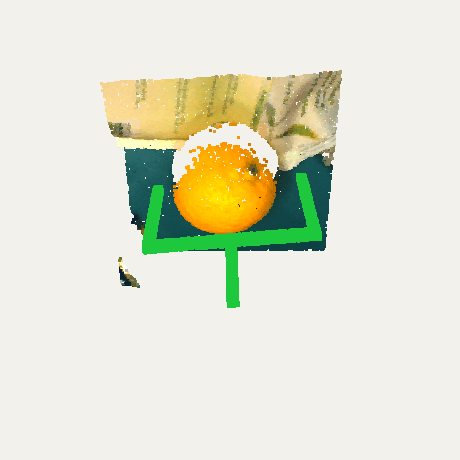

# VOCC-Grasp: Calibrated Occlusion Reasoning for Robotic Grasping

Repository for VOCC-Grasp. Given an RGB-D frame and a free-form request, the method predicts
which object must be removed first to reach the target, and returns a 6-DoF grasp for it.

A VLM and an amodal segmenter each propose occlusion edges. Both sources are calibrated and
fused, the posterior is taken over acyclic occlusion graphs by Top-K MAP, and the free-set
marginals come with an approximation certificate used to act or defer.

```
RGB-D
  ├── Gemini ──────────► occlusion chain, p(edge)
  └── UOAIS  ──────────► amodal masks, p(edge) from contact / hidden area / depth order
                              │
                    adaptive Platt per source, then logit fusion          configs/pipeline.yaml
                              │
                    Top-K MAP over the acyclic support D
                    exact enumeration, ILP with
                    lazy acyclicity + no-good cuts (CBC)
                              │
                    free-set marginals q_o, q_X  +  certificate ε_K
                    adaptive stopping: first K with ε_K ≤ ε_target,
                    or an action margin already certified
                              │
                    τ_set = c_FP/(c_FP+c_FN),  τ_act = 1 − λ_defer  →  act or defer
                              │
  FGC-GraspNet on the chosen object ──────────────────────────────────► 6-DoF pose
```

The calibration is fit once on synthetic data and used unchanged for synthetic evaluation, real
evaluation and deployment. Nothing is refit or retrained per domain.

## Resources

| Resource | Link | Description |
| --- | --- | --- |
| Synthetic dataset | [Hugging Face](https://huggingface.co/datasets/chiencn/vocc_synthetic) | UnoBench `test_GT_small_1800` split: 1800 cases, 1400 images. |
| Real dataset | [Hugging Face](https://huggingface.co/datasets/chiencn/vocc_real) | MetaGraspNet-V2 evaluation subset: 838 cases, 511 scenes. |
| UOAIS | [gist-ailab/uoais](https://github.com/gist-ailab/uoais) | Amodal segmenter, fine-tuned here as `uoais-ft/`. |
| FGC-GraspNet | [luyh20/FGC-GraspNet](https://github.com/luyh20/FGC-GraspNet) | Grasp pose model, vendored as `FreeGrasp_code/`. |

## Contents

- [Structure](#structure)
- [Installation](#installation)
- [Dataset](#dataset)
- [Inference](#inference)
- [Demo](#demo)
- [Configuration](#configuration)
- [License](#license)

## Structure

```text
vocc-grasp/
|-- demo.py                          RGB-D frame -> grasp pose
|-- run_gemini_uoais_ref.py          the method: VLM reasoning over a UOAIS geometry table
|-- run_gemini_uoais_ref_batch.py    batch driver, synthetic
|-- run_gemini_uoais_ref_batch_real.py  batch driver, real
|-- export_fused_weighted.py         calibrate + fuse -> per-edge CSV
|-- configs/pipeline.yaml            all thresholds
|-- calibration/                     frozen calibration parameters
|-- math/report_unobench.py          evaluation and reporting
|-- grasp_viz/                       mask -> point cloud -> FGC-GraspNet -> renders
|-- demo_rgbd/                       28 real RGB-D scenes + reference results
|-- uoais-ft/                        UOAIS, fine-tuned
`-- FreeGrasp_code/                  FGC-GraspNet
```

## Installation

Create the Conda environment and build everything:

```bash
./scripts/install.sh uoais
conda activate vocc
```

This creates the env `vocc` (python 3.10), installs torch 2.7.0 cu128 and `requirements.txt`,
compiles the FGC-GraspNet CUDA extensions, and installs detectron2 and AdelaiDet. Tested on an
RTX 5060 Ti (sm_120) with CUDA 12.8.

Download the FGC-GraspNet checkpoint:

```bash
./scripts/download_checkpoints.sh
```

The UOAIS weights need the upstream terms accepted and cannot be redistributed. Download
`R50_rgbdconcat_mlc_occatmask_hom_concat` from
[gist-ailab/uoais](https://github.com/gist-ailab/uoais) and place it at:

```text
uoais-ft/output/R50_rgbdconcat_mlc_occatmask_hom_concat/model_final.pth
```

Set the Gemini API key:

```bash
cp .env.example .env      # then fill in GEMINI_API_KEY
```

## Dataset

Neither dataset is needed to reproduce the reported scores — the fused edge scores ship in the
repository. Download them to regenerate predictions from raw RGB-D, or to run the grasp stage.

### Synthetic

Download UnoBench from [Hugging Face](https://huggingface.co/datasets/chiencn/vocc_synthetic):

```bash
hf download chiencn/vocc_synthetic --repo-type dataset --local-dir /tmp/vocc_syn

mkdir -p UnoBench/_extracted
for f in images depth annotations; do
    mkdir -p UnoBench/_extracted/$f
    tar -xzf /tmp/vocc_syn/$f.tar.gz -C UnoBench/_extracted/$f
done
cp /tmp/vocc_syn/meta/gt_for_nlp.json UnoBench/
```

Expected layout:

```text
vocc-grasp/
|-- UnoBench/gt_for_nlp.json
|-- UnoBench/subset_difficulty/          (already in this repository)
`-- UnoBench/_extracted/{images,depth,annotations}/
```

Depth is in centimetres. UnoBench ships no intrinsics; a pinhole is synthesised from a 60°
vertical FOV.

### Real

Download the MetaGraspNet-V2 subset from
[Hugging Face](https://huggingface.co/datasets/chiencn/vocc_real):

```bash
hf download chiencn/vocc_real --repo-type dataset --local-dir /tmp/vocc_real

for f in scenes images masks_crop masks_full; do
    tar -xzf /tmp/vocc_real/$f.tar.gz -C .
done
cp /tmp/vocc_real/meta/real_world_mapping_fixed.json \
   /tmp/vocc_real/meta/real_object_names.json .
```

Expected layout:

```text
vocc-grasp/
|-- real_world_mapping_fixed.json
|-- real_object_names.json
|-- images/image_000000.png
|-- masks_npy_real_crop/image_000000.npy
`-- data_ifl_0/mnt/data1/data_ifl_real/scene0/{3.npz,3_rgb.png,3_camera_params.json}
```

Depth is in centimetres with about 20% NaN, and these carry real intrinsics.

## Inference

### Reproduce the reported scores

These read the fused edge scores shipped in `logs/`. No GPU, no API key, no dataset download.

```bash
python math/report_unobench.py \
  --csv logs/edge_scores_csv_test1800_full/fused_adaptive_w0.5_0.5_m1.csv \
  --tau-edge 0.09

python math/report_unobench.py \
  --csv logs/edge_scores_csv_real_subset/fused_adaptive_w0.5_0.5_m1.csv \
  --gt test_GT_subset_hardall_easy300_medium300.json \
  --tau-edge 0.09
```

Both report success-rate metrics, occlusion-reasoning metrics and MP-NED by difficulty level.

### Regenerate predictions from raw RGB-D

Needs the dataset, a GPU and a Gemini API key. Each source is run separately, then fused.

Synthetic:

```bash
python run_uoais_pipeline.py \
  --gt-path UnoBench/gt_for_nlp.json \
  --out logs/uoais_1800_v2

python run_gemini_uoais_ref_batch.py \
  --gt-path UnoBench/gt_for_nlp.json \
  --out logs/gemini_uoais_ref_test_1800

python export_fused_weighted.py \
  --vlm-log logs/gemini_uoais_ref_test_1800 \
  --uoais-log logs/uoais_1800_v2 \
  --gt-path UnoBench/subset_difficulty/test_GT_small_1800.json \
  --out logs/edge_scores_csv_test1800_full \
  --weights "0.5,0.5,-1"
```

Real:

```bash
python run_uoais_pipeline_real.py \
  --gt-path test_GT_subset_hardall_easy300_medium300.json \
  --out logs/uoais_pipeline_real

python run_gemini_uoais_ref_batch_real.py \
  --gt-path test_GT_subset_hardall_easy300_medium300.json \
  --id-map real_world_mapping_fixed.json \
  --out logs/gemini_uoais_ref_real_subset

python export_fused_weighted.py \
  --vlm-log logs/gemini_uoais_ref_real_subset \
  --uoais-log logs/uoais_pipeline_real \
  --gt-path test_GT_subset_hardall_easy300_medium300.json \
  --out logs/edge_scores_csv_real_subset \
  --weights "0.5,0.5,-1"
```

`--weights` is `w_vlm,w_3d,w_prior`; `0.5,0.5,-1` produces
`fused_adaptive_w0.5_0.5_m1.csv`, the file the report above reads.

## Demo

One RGB-D frame in, a grasp pose out. 28 real scenes ship in `demo_rgbd/`, so this runs without
any dataset download:

```bash
python demo.py --case img000071_q1
```

The request is `top pouch`; an orange sits on it. The method removes the orange first:

```text
[2/5] detecting objects  [Gemini]
      5 objects: 1=soap refill pouch, 2=orange, 3=deodorant roll-on, 4=food can, 5=oil filter
[3/5] amodal segmentation + occlusion geometry  [UOAIS]
      11 instances, 1 occlusion edge
[4/5] reasoning  [Gemini]
      grasp first: id=2 (orange), chain 1 step(s), confidence 90.0
[5/5] grasp pose  [FGC-GraspNet]
      gripper: robotiq_2f85, jaws <= 80 mm
      grasp_found=True
```

<p align="center">
  
  
</p>

`output/img000071_q1/` holds the renders, the orbit GIF, `grasp_pose.json` (6-DoF, camera frame)
and `plan.json` (the removal order).

Object names, ids and confidence come from the VLM and vary between runs; the object chosen does
not. To reproduce the bundled reference exactly:

```bash
python demo.py --case img000071_q1 --masks provided
```

This matches `demo_rgbd/expected/img000071_q1.json`: translation `[0.0561, -0.0230, 0.6495]` m,
score `0.642`.

Run on your own frame:

```bash
python demo.py --rgb scene.png --depth depth.png --intrinsics k.json --request "the white box"
```

Check the bundled data and replay the grasp stage:

```bash
python demo_rgbd/verify.py         # integrity only
python demo_rgbd/verify.py --run   # grasp replay, needs a GPU and the FGC weights
```

## Configuration

Edge probabilities are calibrated with an N-candidate adaptive Platt scaling per source, then
fused in logit space at equal weights. Both are fit once on synthetic data and frozen.

Every threshold is in [`configs/pipeline.yaml`](configs/pipeline.yaml). The calibration
coefficients and their fit report are in [`calibration/`](calibration/README.md).

## License

MIT for the code written here. `FreeGrasp_code/` and `uoais-ft/` keep their upstream licenses;
`demo_rgbd/` and both datasets follow MetaGraspNet-V2's terms.
