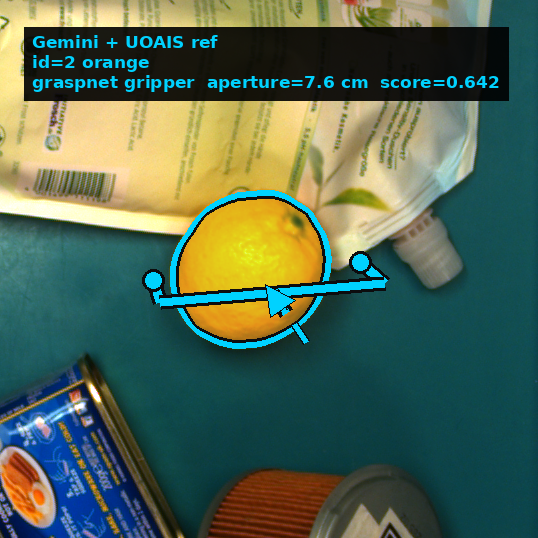

<div align="center">

# VOCC-Grasp

**Which object do I move first?**
Calibrated occlusion reasoning for grasping in clutter.


</div>

A VLM proposes the occlusion structure of a bin and an amodal segmenter scores the same
structure from geometry. Both edge sources are calibrated and fused into one probability per
edge. The posterior is then taken over **acyclic** occlusion graphs — not a single graph —
and the resulting free-set marginals carry an approximation certificate, so the decision to
act or defer is made under a bound rather than a guess.

```
RGB-D
  ├── Gemini ──────────► occlusion chain, p(edge)
  └── UOAIS  ──────────► amodal masks, p(edge) from contact / hidden area / depth order
                              │
                    adaptive Platt per source, then logit fusion          configs/pipeline.yaml
                              │
                    Top-K MAP over the acyclic support D
                    exact enumeration ≤ 20 edges, else ILP with
                    lazy acyclicity + no-good cuts (CBC)
                              │
                    free-set marginals q_o, q_X  +  certificate ε_K
                    adaptive stopping: first K with ε_K ≤ ε_target,
                    or an action margin already certified
                              │
                    τ_set = c_FP/(c_FP+c_FN),  τ_act = 1 − λ_defer  →  act or defer
                              │
  FGC-GraspNet on the chosen object ──────────────────────────────────► 6-DoF pose
```

The certificate is tail-model-free: `Z̄ = Π(1 − p_ij p_ji) ≥ Z` bounds the partition
function from above, so `ε_K = (Z̄ − Z_K)/Z̄` bounds the marginal error without assuming
anything about the unenumerated tail. [`math/Mathematical.md`](math/Mathematical.md) derives
it.

## Install

```bash
./scripts/install.sh uoais            # conda env "vocc", torch cu128, requirements,
                                      # FGC extensions, detectron2 + AdelaiDet
conda activate vocc
./scripts/download_checkpoints.sh     # FGC weights (13 MB)
cp .env.example .env                  # add your Gemini API key
```

The demo runs UOAIS, so it needs both the `uoais` install and the UOAIS weights (427 MB).
Those cannot be redistributed here: `download_checkpoints.sh` prints where to get
`R50_rgbdconcat_mlc_occatmask_hom_concat` and where to put it. Without the `uoais` argument
you get the reports and the data self-check, but not the demo.

Tested on an RTX 5060 Ti (sm_120) with torch 2.7.0+cu128.

## Demo

One RGB-D frame in, a grasp pose out. 28 real scenes ship in [`demo_rgbd/`](demo_rgbd/), so
no dataset download is needed — a Gemini key, the FGC weights and the UOAIS weights are:

```bash
conda activate vocc
python demo.py --case img000071_q1
```



The user asks for the **top pouch**; an **orange** sits on it. The pipeline says clear the
orange first and returns a pose for it.

```
[2/5] detecting objects  [Gemini]
      5 objects: 1=soap refill pouch, 2=orange, 3=deodorant roll-on, 4=food can, 5=oil filter
[3/5] amodal segmentation + occlusion geometry  [UOAIS]
      11 instances, 1 occlusion edge
[4/5] reasoning  [Gemini]
      grasp first: id=2 (orange), chain 1 step(s), confidence 90.0
[5/5] grasp pose  [FGC-GraspNet]
      gripper: robotiq_2f85, jaws <= 80 mm
      grasp_found=True
```

`output/img000071_q1/` holds the annotated renders, the orbit GIF, `grasp_pose.json`
(6-DoF, camera frame) and `plan.json` (the removal order).

Object names, badge numbers and the confidence come from the VLM and differ between runs;
which object gets picked does not. For a bit-for-bit check, run against the bundled instance
masks instead of UOAIS's:

```bash
python demo.py --case img000071_q1 --masks provided
```

That reproduces [`demo_rgbd/expected/img000071_q1.json`](demo_rgbd/expected/): translation
`[0.0561, -0.0230, 0.6495]` m, score `0.642`, funnel 262 → 200 → 135 → 61.

Your own frame:

```bash
python demo.py --rgb scene.png --depth depth.png --intrinsics k.json --request "the white box"
```

<br clear="right">

## Results

UnoBench `test_GT_small_1800` — 600 Easy / 600 Medium / 600 Hard.

| | Easy | Medium | Hard | **Balanced SR-F1** | edge ECE | object ECE |
|---|---:|---:|---:|---:|---:|---:|
| UOAIS 3D only | 0.922 | 0.648 | 0.524 | 0.523 | 0.366 | – |
| UnoGrasp | 0.915 | 0.699 | 0.524 | 0.534 | – | – |
| Gemini | 0.924 | 0.691 | 0.448 | 0.516 | 0.202 | 0.586 |
| Gemini + 3D reference | 0.945 | 0.630 | 0.476 | 0.513 | 0.146 | 0.457 |
| D3G | 0.980 | 0.542 | 0.375 | 0.632 | – | – |
| **Ours** | 0.938 | 0.672 | 0.556 | **0.722** | **0.139** | **0.086** |

Reproduce, from the shipped edge scores — no GPU and no API key needed:

```bash
cd math
python report_unobench.py --csv ../logs/edge_scores_csv_test1800_full/fused_adaptive_w0.5_0.5_m1.csv --tau-edge 0.09
python report_unobench.py --csv ../logs/edge_scores_csv_real_subset/fused_adaptive_w0.5_0.5_m1.csv \
                          --gt ../test_GT_subset_hardall_easy300_medium300.json --tau-edge 0.09
```

Synthetic **0.722**, real **0.553**. Every system in the comparison:
[`docs/all_results.md`](docs/all_results.md).

## Data

| | |
|---|---|
| UnoBench (synthetic) | `<placeholder: Hugging Face link>` → `UnoBench/_extracted/{images,depth,annotations}/` |
| MetaGraspNet-V2 (real) | `<placeholder: filtered subset link>` — not needed for the demo |

UnoBench depth is in **centimetres** and ships no intrinsics; a pinhole is synthesised from a
60° vertical FOV. The evaluation splits are already in `UnoBench/subset_difficulty/`.

## Configuration

Every threshold the pipeline runs on lives in **[`configs/pipeline.yaml`](configs/pipeline.yaml)**
— detector thresholds, edge-scoring rules, fusion weights, Top-K solver limits, decision
thresholds, grasp filters.
`demo.py` loads it; the batch drivers take the same values as defaults. The reported numbers
were produced with that file unchanged.

| | file |
|---|---|
| Pipeline parameters | [`configs/pipeline.yaml`](configs/pipeline.yaml) |
| Calibration coefficients | [`calibration/adaptive_platt_model.json`](calibration/) (VLM), `adaptive_platt_3d_model.json` (3D) |
| Fit report: splits, ECE before/after | [`calibration/README.md`](calibration/README.md) |
| Gripper geometry | [`grasp_viz/gripper_robotiq_2f85.yaml`](grasp_viz/gripper_robotiq_2f85.yaml) |

The calibration is fit **once**, on a scene-disjoint slice of the synthetic training split, and
used unchanged for synthetic evaluation, real evaluation and deployment. Nothing is refit per
domain.

## Self-check

```bash
python demo_rgbd/verify.py         # data integrity — no GPU, no key, no weights
python demo_rgbd/verify.py --run   # replay the grasp stage — needs a GPU and the FGC weights
```

28/28 scenes, recorded pose recovered within 0.001 mm and 0.044°.

## Structure

```
demo.py                     RGB-D → grasp pose
run_gemini_uoais_ref*.py    the model: VLM reasoning over a UOAIS geometry table
export_fused_weighted.py    calibrate + fuse → the edge CSVs the math stack reads
math/                       marginalisation, decision policy, reporting
calibration/                frozen Platt parameters and their fit reports
grasp_viz/                  segmentation → point cloud → FGC → renders
configs/pipeline.yaml       every threshold, in one place
demo_rgbd/                  28 real RGB-D scenes + expected results + verify.py
uoais-ft/                   UOAIS, fine-tuned      github.com/gist-ailab/uoais
FreeGrasp_code/             FGC-GraspNet           github.com/luyh20/FGC-GraspNet
```

## Licence

MIT for the code here. `FreeGrasp_code/` and `uoais-ft/` keep their upstream licences;
`demo_rgbd/` follows MetaGraspNet-V2's terms.
